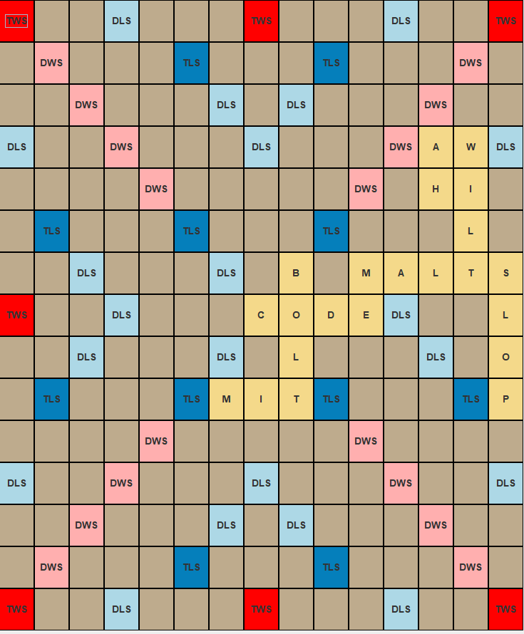

# *Scrabble* in Java

## Proposal
- **What will the application do?**

This project will be a re-creation of the game *Scrabble*, made within Java. *Scrabble* is a turn based game where players draw letter tiles at random until they have 7 tiles on their tile rack or the bag of tiles is empty. Players take turns placing their letters on a board to form words and score points. Each letter has a preassigned value, and there are special spaces on the board which can multiply either letter or word scores the first time a tile is played on them. Play ends when any player has no tiles left on their tile rack to play, and the bag of random tiles to draw from is empty. Any unplayed tiles from the remaining players are then totalled and subtracted from their corresponding player's score. The combined value of unplayed tiles is then added to the score of the player who made the final move.

The game will be played between two or more players locally. Initially, the game will be playable through the command line, where players will select where to place their tiles on the board using a (row, column) coordinate system. Once this is fully functional, a graphical user interface will be developed.

- **Why did I choose to create this?**

This project is of interest to me since *Scrabble* was one of my favorite board games as a kid, and I still enjoy it. Furthermore, I dislike how the online or mobile application versions of *Scrabble* I have used automatically indicate to the user whether the word they have played is valid. This fundamentally changes how the game is played compared to the version with a physical board since it allows players to guess and check words as many times as they would like without any consequence.

## User Stories
1. As a user I want to be able to create a new board.

2. As a user I want to be able to move letters from my tile rack onto the board.

3. As a user I want to have the appropriate number of letters added to my rack at the start of my first turn, or after I play a word.

4. As a user I want to be able to view the remaining quantity of each letter tile, combined between my opponents' tile racks and the draw bag.

5. As a user, when I play a word I want to have it added to my history of words played, including its letters, start and end coordinates and its points.

6. As a user I'd like to have the option to quit my game, and be prompted to see if I want to save it.

7. As a user when I run the application I'd like to have the choice between continuing a previous, unfinished game, or starting a new game.

## Instructions for End User

1. Run the program from ScrabbleVisualApp.java to open the Graphical User Interface.
Here you will see the visual component of the application, which is a background image on the "Start Menu" frame.
2. Select whether you would like to load your saved game or play a new game.
3. If you selected play a new game then a new frame will pop up for you to input player names in the desired order of play.
4. Type the first player's name, then click "Add player with name in textbox".
5. Repeat step 4 until all desired players have been added. Then click "Start Game" to begin playing. 
6. Now a new frame will appear titled "Scrabble Game".
7. To add a move to a your player's history, you may either play a word, swap tiles, or skip your turn. 
8. To play a word, click on the tiles in your rack in the order you'd like to place them. At some point before clicking "Play",
 you must click the space on the board where you would like to start your turn from. There is a button which will either display as "Down" or "Right".
 Click this button to toggle the direction your tiles will be placed in. Whichever is currently displayed is the currently selected direction.
 9. The board will update to reflect the tiles you've now placed,
 and replacement tiles will be drawn onto your rack provided that tiles remain in the draw pile. Your score will update in the top left of the frame. 
10. To swap you select the tiles you'd like to get rid of, then click "Swap".
11. To skip, simply press "Skip".
12. For any move you make, its summary will be visible to the right, under "All Moves", which is displayed by default. If you would 
like to view only words, then you can press the "Filtered Words" tab, then if you press "Search" while the textbox is clear, all your 
words will display. If you want to only view words with a certain letter, then you can enter that letter in the textbox then click "Search".
13. If you would like to know how many of a given tile remains unplayed, between your opponents' tile racks and the draw pile, then you can
click on the "Remaining Tile Counts" tab towards right of the frame. This functions similarly to viewing filtered words. To view all tile counts
press "Search" while the textbox is empty, or enter a specific character into the textbox to view only that character's count after you press "Search". 
14. If you are tired of playing, then can look towards the bottom of the "Scrabble Game" frame to find the appropriate buttons. 
Namely, if you'd like to save the game then press "Save and Quit", if you don't want to save then press "Quit without Saving".

## Phase 4: Task 2
Wed Mar 26 13:32:22 PDT 2025  
Player1 played CODE starting at (7,7) and moving to the right earning 14 points.    
Wed Mar 26 13:32:31 PDT 2025  
Player2 played MALT starting at (6,10) and moving to the right earning 11 points.   
Wed Mar 26 13:32:50 PDT 2025  
Player1 played SLOP starting at (6,14) and moving down earning 25 points.   
Wed Mar 26 13:33:05 PDT 2025  
Player2 played BLT starting at (6,8) and moving down earning 10 points.  
Wed Mar 26 13:33:19 PDT 2025  
Player1 played WIL starting at (3,13) and moving down earning 9 points.    
Wed Mar 26 13:33:22 PDT 2025  
Player2 skipped their turn.    
Wed Mar 26 13:33:26 PDT 2025  
Player1 swapped tiles. Their tiles before swapping were: FRNEETN and their tiles after swapping were ONQINIO, earning 0 points.  
Wed Mar 26 13:33:38 PDT 2025  
Player2 played AH starting at (3,12) and moving down earning 15 points.  
Wed Mar 26 13:33:47 PDT 2025  
Player1 swapped tiles. Their tiles before swapping were: ONQINIO and their tiles after swapping were ONUNNSV, earning 0 points.  
Wed Mar 26 13:34:06 PDT 2025  
Player2 played MI starting at (9,6) and moving to the right earning 5 points.  
