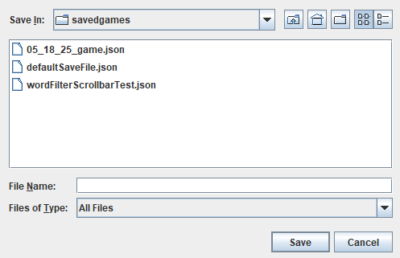

# *Scrabble* in Java

- **What will the application do?**

This project is a re-creation of the game *Scrabble*, made within Java. *Scrabble* is a turn based game where players draw letter tiles at random until they have 7 tiles on their tile rack or the bag of tiles is empty. Players take turns placing their letters on a board to form words and score points. Each letter has a preassigned value, and there are special spaces on the board which can multiply either letter or word scores the first time a tile is played on them. Play ends when any player has no tiles left on their tile rack to play, and the bag of random tiles to draw from is empty. Any unplayed tiles from the remaining players are then totalled and subtracted from their corresponding player's score. The combined value of unplayed tiles is then added to the score of the player who made the final move.

The game is played between two or more players locally. The game is playable either through the command line or through a graphical user interface, and users have the option to switch between these interfaces as they please.

- **Why did I choose to create this?**

This project is of interest to me since *Scrabble* was one of my favorite board games as a kid, and I still enjoy it. Furthermore, I dislike how the online or mobile application versions of *Scrabble* I have used automatically indicate to the user whether the word they have played is valid. This fundamentally changes how the game is played compared to the version with a physical board since it allows players to guess and check words as many times as they would like without any consequence.

## Instructions

1. Run the program from ScrabbleVisualApp.java to open the Graphical User Interface. \
***Note:*** Run ScrabbleConsoleApp.java to begin with the Terminal UI, or press the 'Terminal UI' button from within the GUI. Terminal UI instructions are self-contained within that mode.
2.  Select whether you would like to begin a new game; continue your last game; or load a specific saved game after selecting it from the drop-down menu at the bottom of the window.

3. If you selected play a new game then a window will pop up for you to input player names in the desired order of play.
4. Type the first player's name, then click 'Add player with name in textbox', or press 'ENTER' on your keyboard.

5. Repeat step 4 until all desired players have been added. Then click 'Start Game' to begin playing. 
6. Now a new window will open for gameplay.

7. ***To play a word :*** Click on the tiles in your rack in the order they form your word. At some point before clicking 'Play',
 you must click the space on the board where you would like to start your turn from. There is a button in the bottom panel which will either display 'Down' or 'Right'. 

  

>Click this button to toggle the direction your tiles will be placed in. Whichever is currently displayed is the currently selected direction. 
>If you want to review your selections before playing the word you may press 'Preview' to see a preview, then either 'Confirm' or  'Cancel' the move.

8. ***To swap tiles*** : Select the tiles you'd like to get rid of, then click 'Swap'. A tile's border color changes once it is selected, but this is sometimes difficult to see depending on your monitor settings, blue light filters, etc. If you are ever unsure of your selection you may press the 'Clear' button then reselect the tiles.

9. ***To skip***, simply press 'Skip'.

10. ***How to view your move summary:*** For any move you make, its summary will be visible towards the right of the window, under "All Moves", which is displayed by default. 
11. ***How to view your words played:*** Press the "Filtered Words" tab, then press 'Search' while the textbox is clear to have all your words display. If you want to only view words with a certain letter, then you can enter that letter in the textbox before clicking 'Search'. 

 

12. ***How to see how many tiles remain:*** If you would like to know how many of a given tile remains unplayed, between your opponents' tile racks and the draw pile, then you can click on the "Letter Distribution" tab towards right of the window. To view all tile counts press 'Search' while the textbox is empty, or enter a specific character into the textbox to view only that character's count after you press 'Search'.\
 

13. ***How to Save/Quit:*** If you want to stop playing, then can press the 'Save and Quit' button near the bottom of the window. This will open up a new panel of buttons where you may choose to 'Save & Quit', 'Save as & Quit', 'Quit without Saving', or 'Cancel'. \

    If you click 'Save as & Quit' then a file explorer window will pop up allowing you to title you saved game. 

14. When you exit the game an Event Log will print to the console summarizing the moves which occured in this session (not the entire game).

## Additional Notes on Game Instructions ##
-If you press 'Preview' then 'Cancel' your selected tiles will become unselected. \
-If you attempt an illegal word placement your tile selections will be cleared and an error message will print to the console. You may then reattempt your turn. \
-Searches in the Letter Distribution and Filtered Words tabs not case sensitive. \
-If multiple characters are entered into a search field within the play window then only the first character is used for the query. 

## Terminal UI Visual Example
 

  

## Event Logging Demo
Wed Mar 26 13:32:22 PDT 2025  
Player1 played CODE starting at (7,7) and moving to the right earning 14 points.    
Wed Mar 26 13:32:31 PDT 2025  
Player2 played MALT starting at (6,10) and moving to the right earning 11 points.   
Wed Mar 26 13:32:50 PDT 2025  
Player1 played SLOP starting at (6,14) and moving down earning 25 points.   
Wed Mar 26 13:33:05 PDT 2025  
Player2 played BLT starting at (6,8) and moving down earning 10 points.  
Wed Mar 26 13:33:19 PDT 2025  
Player1 played WIL starting at (3,13) and moving down earning 9 points.    
Wed Mar 26 13:33:22 PDT 2025  
Player2 skipped their turn.    
Wed Mar 26 13:33:26 PDT 2025  
Player1 swapped their tiles.  
Wed Mar 26 13:33:38 PDT 2025  
Player2 played AH starting at (3,12) and moving down earning 15 points.  
Wed Mar 26 13:33:47 PDT 2025  
Player1 their swapped tiles.  
Wed Mar 26 13:34:06 PDT 2025  
Player2 played MI starting at (9,6) and moving to the right earning 5 points.  
